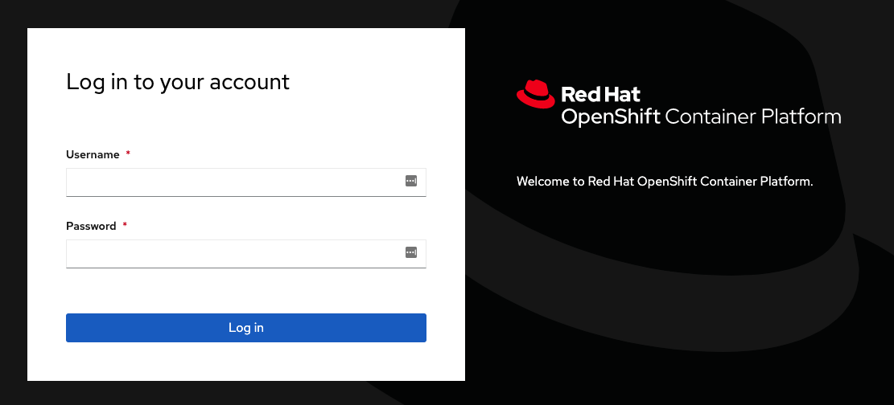
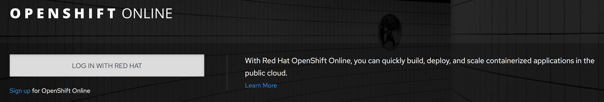

Самый простой способ получить доступ к функциональности OpenShift - веб-консоль. Рабочая URL устанавливается во время создания кластера. Параметры учетной записи могут быть предопределены провайдером идентификации.

В данном сценарии используется URL:

``https://console-openshift-console-[[HOST_SUBDOMAIN]]-443-[[KATACODA_HOST]].environments.katacoda.com``{{copy}}

Чтобы видеть консоль совместно с описанием действий, вы можете использовать вкладку _Console_ tab справа от вкладки _Terminal_.

Ввиду того, что кластер OpenShift управляет аутентификацией пользователей, веб-консоль требует ввода ваших учетных данных _Username_ and _Password_.

В случае использования внешней аутентификации необходимо в первую очередь воспользоваться входом на внешний сервис. Например при работе с [OpenShift Online](https://www.openshift.com/get-started/) вы увидите:

Для данного сценария используйте следующие учетные данные:

* **Username:** ``developer``{{copy}}
* **Password:** ``developer``{{copy}}

При первой загрузке на платформу OpenShift вы увидите сообщение "Welcome to OpenShift" и предложение создать проект.

Создание проекта происходит при нажатии кнопки _Create Project_. Назовём наш проект ``myproject``{{copy}}.

После создания проекта вы увидите страницу с его параметрами.

Для обзора всех доступных проектов выбираем "Home->Projects" из меню на левой стороне консоли. Если меню скрыто, нажмите на кнопку "гамбургера":) слева вверху консоли.

