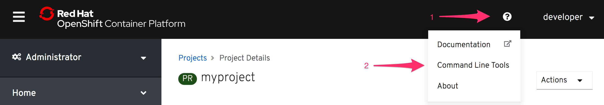

Веб-консоль OpenShift предоставляет удобные визуальные инструменты контроля производственного процесса. Однако не все задачи можно оперативно выполнить через неё. В любом случае понадобятся навыки работы с интерфейсом командной строки.

В данном сценарии CLI доступен через терминал и устанавливать отдельный инструмент не нужно.

Если вы уже работаете с кластером OpenShift без CLI, вы можете скачать инструмент для доступа через веб-консоль к интерфейсу CLI в пункте _Command Line Tools_ .



Ссылка на подробную информацию о том, где получить инструменты командной строки, также будет показана на начальной странице приветствия, когда вы впервые обращаетесь к кластеру.

Как только вы перейдете к списку загрузок, вам нужно будет загрузить архив для вашей платформы, распаковать бинарный файл установить его.

Чтобы войти в кластер OpenShift, используемый для этого курса, запустите в терминале:

``oc login -u developer -p developer``{{execute}}

Вы увидите следующий вывод терминала:

```
Authentication required for https://openshift:6443 (openshift)
Login successful.

Так как созданных проектов ещё нет, создаем первый при помощи команды:

    oc new-project <projectname>
```
Далее задаём пространство имён (namespace):

``oc new-project myproject``{{execute}}

Следующей командой можно вывести доступные нам проекты:

``oc get projects``{{execute}}

Проверить пользователя, под которым мы сейчас "залогинились" можно командой:

``oc whoami``{{execute}}

Также в целях безопасности важно проверить имя нашего текущего сервера:

``oc whoami --show-server``{{execute}}

Аутентификация при момощи внешнего провайдера требует дополнительных действий.

При использовании команды ``oc login`` командная строка возвращает следующую ошибку:

```
Login failed (401 Unauthorized)
You must obtain an API token by visiting
  https://api.starter-us-east-1.openshift.com/oauth/token/request
```

Необходимо пройти по специальной ссылке, если используется отдельный центр аутентификации. Как правило ссылка ведёт на страницу с деталями процедуры аутентификации. Запросы такого типа также могут возвращать электронный сертификат доступа для очередной сессии.

Даже при условии полного управления учётными записями на стороне OpenShift, можно дополнительно использовать токены. Для этого добавляется ``/oauth/token/request`` для URL доступа к кластеру.

Если вы уже находитесь в веб-консоле, вы можете найти полную информацию о параметрах входа и скопировать её для терминала в пункте _Copy Login Command_ под именем учетной записи.

 

Вне зависимости от механизма авторизации с использованием команды ``oc login``, время действия логина заканчивается и требуется повторная авторизация. Обычно это период 24 часа.
